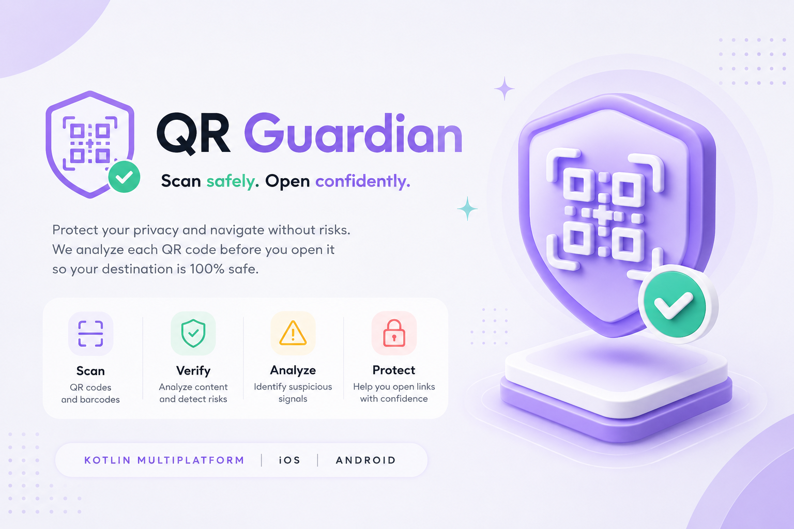
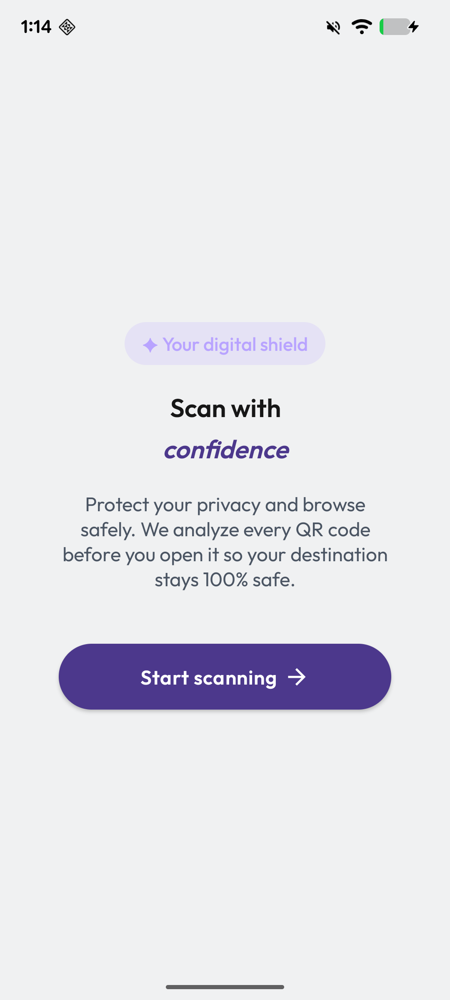
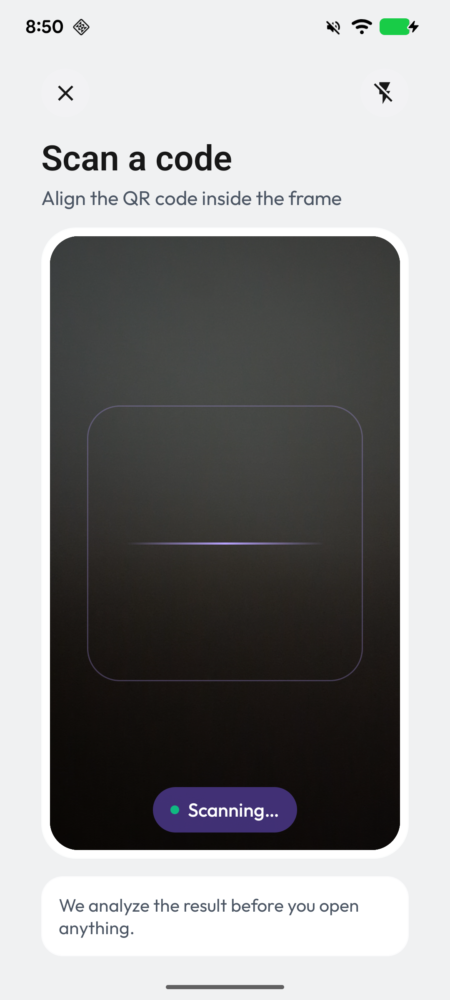
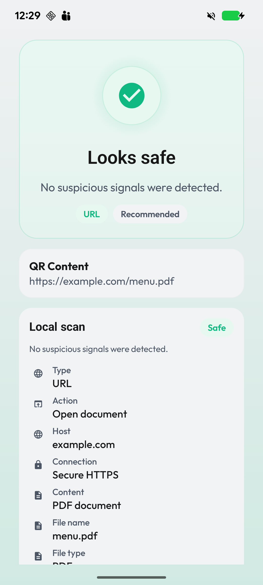
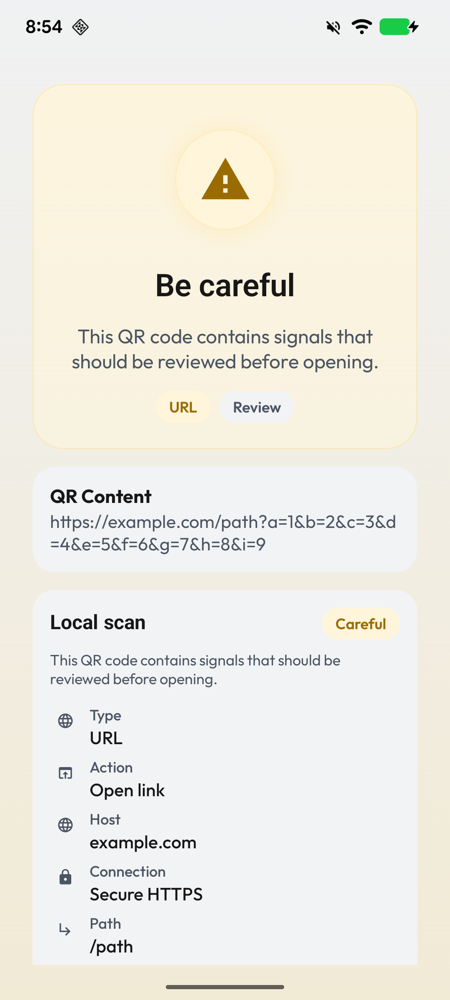
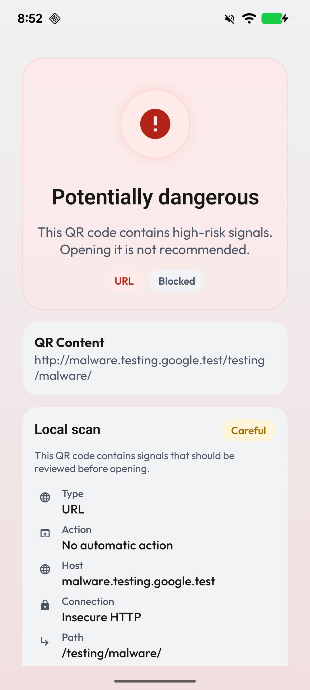

<p align="center">
  
</p>

# QR Guardian

> Escanea con más seguridad. Abre con más confianza.

[English](README.md) · [Español](README.es.md)

[](https://kotlinlang.org/docs/multiplatform.html)
[](https://www.jetbrains.com/compose-multiplatform/)
[](https://developer.android.com/)
[](https://kotlinlang.org/docs/packages.html)

QR Guardian es una app móvil Kotlin Multiplatform para Android e iOS que escanea códigos QR y de barras, clasifica el contenido y muestra un resultado de seguridad antes de que el usuario decida abrir algo.

## Qué hace QR Guardian

- Detecta códigos QR, códigos de barras y tipos de contenido habituales.
- Ejecuta por defecto una verificación local en cada escaneo.
- Solo realiza reputación remota opcional para URLs.
- Nunca abre el contenido escaneado de forma automática.
- Presenta resultados claros antes de que el usuario actúe.

## Capturas

| Intro | Cámara |
|---|---|
|  |  |

| Resultado: análisis local seguro | Resultado: análisis local sospechoso | Resultado: URL peligrosa bloqueada |
|---|---|---|
|  |  |  |

## Dataset de QRs de ejemplo

QR Guardian incluye un pequeño dataset sintético para pruebas manuales y demos.
Cubre URLs seguras, URLs sospechosas, descargas, WiFi, SMS, email, texto plano, crypto, vCard y geo.

Sirve para validar los heurísticos del análisis local, las comprobaciones HEAD y el renderizado de resultados. Remote Reputation depende de la configuración de proveedores y del resultado de la consulta en vivo.

Los payloads de texto subyacentes también están cubiertos por tests de regresión compartidos, así que las imágenes de ejemplo se mantienen como assets de QA manual y no como fixtures automatizadas de decodificación.

Dataset: [docs/assets/sample-qrs/README.md](docs/assets/sample-qrs/README.md)

## Flujo principal

Intro
→ Cámara
→ QR/código de barras detectado
→ Local Scan
→ Remote Reputation, opcional
→ Resultado

La app siempre muestra el resultado antes de abrir cualquier cosa. La acción de abrir solo aparece para resultados de URL que no estén clasificados como peligrosos.

## Modelo de seguridad

### Local Scan

- Siempre activo.
- Funciona sin API keys.
- Usa comprobaciones locales de QR y contenido para clasificar el payload.
- Bloquea esquemas peligrosos como `javascript:`, `file:`, `data:` e `intent:`.
- Comprueba HTTP frente a HTTPS, formas sospechosas de URL y destinos con IP o aspecto local.
- Hace inspección de metadata con HEAD para URLs cuando el servidor lo permite y, si hace falta, recurre a inferencias basadas en la ruta.
- Detecta contenido descargable, como enlaces a PDF o menús, como metadata de archivo.
- Trata descargas de ejecutables o scripts como alto riesgo.
- No llama a servicios externos de reputación.

### Remote Reputation

- Opcional y solo para URLs.
- Usa Google Safe Browsing y URLhaus cuando está configurado.
- Muestra `Not configured` cuando no hay keys.
- Maneja los fallos de los proveedores de forma segura y mantiene visible el resultado local.
- Un resultado limpio de reputación remota no garantiza que la URL sea segura.
- No guarda claves en el repositorio.

Los enlaces a PDF y menús se muestran primero como metadata de archivo. No se tratan automáticamente como peligrosos solo por apuntar a un archivo descargable.

## Primeros pasos

### Android

1. Abre el proyecto en Android Studio.
2. Ejecuta la configuración `androidApp` o `./gradlew :androidApp:assembleDebug`.
3. La cámara requiere permiso para poder escanear.
4. No hacen falta API keys para el modo local-only.
5. Opcional: crea `local.properties` a partir de `local.properties.example` para activar proveedores remotos.

### iOS

1. Abre `iosApp/iosApp.xcodeproj` en Xcode.
2. Ejecuta el target `iosApp`.
3. La cámara requiere permiso para poder escanear.
4. No hacen falta API keys para el modo local-only.
5. Opcional: copia `iosApp/Configuration/RemoteReputation.example.xcconfig` a `iosApp/Configuration/RemoteReputation.xcconfig` y añade las keys.

### Permisos de cámara

- Android usa `android.permission.CAMERA`.
- iOS usa `NSCameraUsageDescription`.
- Si el permiso está denegado, el escáner no puede arrancar.

## Configuración opcional de Remote Reputation

QR Guardian funciona desde el primer momento sin API keys. Deja los valores vacíos para mantener el modo local-only.

### Android

1. Copia o crea `local.properties` en la raíz del proyecto.
2. Añade las keys:

```properties
GOOGLE_SAFE_BROWSING_API_KEY=your_google_key
URLHAUS_API_KEY=your_urlhaus_auth_key
```

### iOS

1. Copia `iosApp/Configuration/RemoteReputation.example.xcconfig` a `iosApp/Configuration/RemoteReputation.xcconfig`.
2. Añade las keys:

```xcconfig
GOOGLE_SAFE_BROWSING_API_KEY = your_google_key
URLHAUS_API_KEY = your_urlhaus_auth_key
```

Las API keys incrustadas en una app móvil no pueden protegerse por completo. Esta configuración es adecuada para desarrollo, demos y portfolio. En producción, lo correcto es usar un backend o un proxy.

## Arquitectura e inyección de dependencias

- La lógica compartida de dominio y presentación vive en Kotlin Multiplatform.
- Compose Multiplatform se usa para la UI compartida.
- Ktor Client se encarga de las comprobaciones HEAD y de las peticiones de reputación remota.
- Koin solo se usa en el borde de wiring de la app.
- `QrGuardianSecurityPipelineFactory` es la única fuente de verdad para componer el pipeline.
- El dominio sigue siendo independiente del framework.

La inyección de dependencias se maneja con Koin, pero solo en el borde de wiring de la app. El pipeline de seguridad lo ensambla `QrGuardianSecurityPipelineFactory`, lo que mantiene el grafo de dependencias explícito, testeable e independiente del framework de DI.

## Aspectos de portfolio

- Pipeline de seguridad compartido en Kotlin Multiplatform.
- UI con Compose Multiplatform para Android e iOS.
- Escaneo de QR y códigos de barras con cámara.
- Verificaciones locales de URLs e inspección de metadata con HEAD.
- Proveedores remotos de reputación opcionales.
- Koin limitado al borde de wiring.
- Lógica de dominio cubierta con tests unitarios.

## Tests y validación

Validado recientemente con:

```bash
./gradlew :shared:allTests
./gradlew check
git diff --check
```

Comandos locales opcionales que también son válidos para este repositorio:

```bash
./gradlew spotlessCheck
./gradlew spotlessApply
./gradlew :androidApp:assembleDebug
./gradlew :shared:testAndroidHostTest
./gradlew :shared:iosSimulatorArm64Test
./gradlew :shared:koverHtmlReport
```

El formato usa Spotless con ktlint para archivos Kotlin y scripts Gradle Kotlin. Ejecuta `spotlessApply` en local antes de hacer commit si `spotlessCheck` detecta problemas de formato. Los tests compartidos cubren normalización, heurísticos locales de URL, análisis de metadata, inferencia de archivos/descargas, composición de reputación remota y bloqueo del botón de abrir.

GitHub Actions CI ejecuta validación de entorno, Android lint, comprobaciones opcionales de Spotless, tests compartidos, generación no bloqueante de Kover XML y ensamblado Android release para pull requests y ejecuciones manuales.

## AI Mobile Tools

Las herramientas de revisión asistida por IA se ejecutan manualmente desde el workflow de GitHub Actions [`AI Mobile Tools`](.github/workflows/ai-tools.yml). Usan [Mobile AI Toolkit](https://github.com/lmartinh/mobile-ai-toolkit/tree/main) para generar artefactos de informe con:

- `compose-guardrails`, orientado a revisar arquitectura Compose, estado, efectos secundarios, accesibilidad y límites multiplataforma.
- `kmp-project-auditor`, orientado a revisar source sets Kotlin Multiplatform y límites entre plataforma y código compartido.

El workflow normal de CI no ejecuta proveedores reales de IA ni requiere secretos de proveedor. El proveedor por defecto de AI Mobile Tools es `fake`, seguro para validación determinista y sin secretos. Los proveedores reales son opt-in manual y requieren secretos configurados en el repositorio o fork donde se ejecuta el workflow.

### Ejecutar AI Mobile Tools con tu propio proveedor

1. Haz un fork del repositorio.
2. Abre tu fork en GitHub.
3. Ve a `Settings` → `Secrets and variables` → `Actions`.
4. Añade el secreto del proveedor que quieras usar:
   - `OPENAI_API_KEY`
   - `ANTHROPIC_API_KEY`
   - `GEMINI_API_KEY`
5. Ve a `Actions` → `AI Mobile Tools`.
6. Pulsa `Run workflow`.
7. Selecciona la rama.
8. Selecciona el proveedor.
9. Selecciona las herramientas.
10. Ejecuta el workflow.

Los proveedores reales solo están disponibles cuando el repositorio o fork que ejecuta el workflow tiene configurado el secreto correspondiente. Las API keys no deben pasarse como inputs del workflow ni commitearse en el repositorio.

Los hallazgos de estas herramientas son consultivos y centrados en informes. Sirven como apoyo para la revisión, pero no sustituyen tests, code review ni criterio manual de seguridad.

## Resolución de problemas

- La cámara no se abre: revisa el permiso de cámara.
- Remote Reputation muestra `Not configured`: faltan las API keys o están vacías.
- No aparece el tipo de archivo o PDF: el servidor puede no soportar HEAD o no exponer `Content-Type` o `Content-Disposition`.
- Las keys de iOS no se detectan: comprueba que `RemoteReputation.xcconfig` esté incluido y que `Info.plist` siga referenciando los valores.

## Documentación

- [Overview](docs/00-overview.md)
- [Functional Specification](docs/02-functional-specification.md)
- [Architecture](docs/03-architecture.md)
- [UI Flow](docs/04-ui-flow.md)
- [Security Model](docs/05-security-model.md)
- [Local Security Checks](docs/security/local-security-checks.md)
- [Remote Reputation](docs/security/remote-reputation.md)
- [Testing Strategy](docs/06-testing-strategy.md)
- [Agent Guidelines](AGENTS.md)

## Licencia

Licenciado bajo la [Apache License 2.0](LICENSE).

## Limitaciones conocidas

- Remote Reputation es opcional y permanece desactivado hasta que se configuren API keys.
- Las API keys móviles no son totalmente secretas dentro de un binario de app.
- HEAD depende del soporte del servidor, así que algunos enlaces no expondrán detalles de archivo.
- Los proveedores remotos pueden devolver falsos negativos, así que una reputación limpia no garantiza seguridad.
- QR Guardian es un proyecto de portfolio y demo, no un sustituto de herramientas de seguridad dedicadas.
