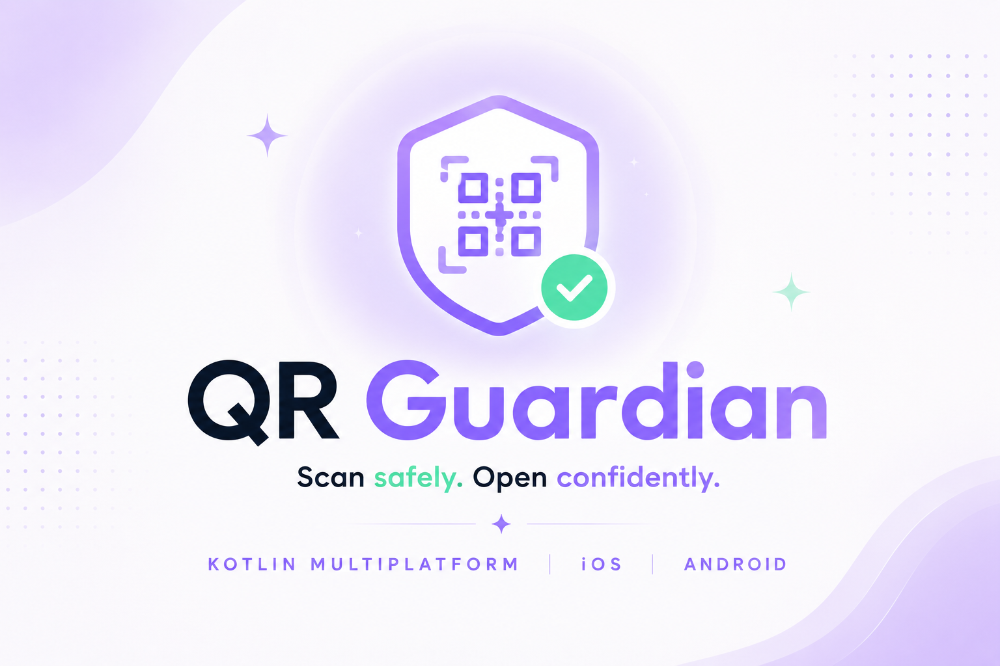

<div align="center">
  
</div>

# QR Guardian

> **Read in another language:** **English** · [Español](README.es.md)

[](https://kotlinlang.org/docs/multiplatform.html)
[](https://www.jetbrains.com/compose-multiplatform/)
[](https://developer.android.com/)
[](https://kotlinlang.org/docs/packages.html)

### Scan smarter. Open safer.

## What is QR Guardian?
QR Guardian is a Kotlin Multiplatform mobile app for Android and iOS.

It scans QR codes and barcodes, detects the scanned content type, and helps users evaluate potentially malicious URLs **before opening them**.

## Why this project?
- Build a practical, security-aware mobile app.
- Showcase clean KMP + Compose architecture in a portfolio-ready project.
- Keep logic shared, UI polished, and behavior predictable.

## Core product flow
1. User opens the app.
2. User starts scanning.
3. App reads QR/barcode content.
4. App detects content type.
5. If content is a URL, app evaluates safety.
6. App shows result first; user decides what to do next.

## Planned main screens
- Intro / Launch
- Camera Capture
- Result

## Safety principles
- Never auto-open scanned URLs.
- Warn clearly on suspicious or malicious results.
- Treat unknown results as uncertain.
- Keep security-provider secrets out of mobile clients.
- Perform a local first-pass verification before any opening action.
- Surface the analyzed content type, security level, reasons, and `canOpen` decision to the result screen.

## Security checks
QR Guardian includes local security checks by default.
Remote reputation checks are prepared but not enabled in the current version.
No API keys are required to run the project.
Future versions may support optional providers configured by each developer.
This repository does not include real API keys or a shared backend.

## Tech stack
- Kotlin Multiplatform
- Compose Multiplatform
- Android + iOS
- Kotlin Coroutines
- Clean Architecture principles

## Project structure
- `androidApp/`: Android host app.
- `iosApp/`: iOS host app (Xcode project).
- `shared/`: shared KMP logic and shared Compose UI.
- `docs/`: product, architecture, roadmap, security and testing docs.

## Run
Android debug build:
```bash
./gradlew :androidApp:assembleDebug
```

iOS (from Xcode):
`iosApp/` → open in Xcode and run target.

## Test
Android host tests:
```bash
./gradlew :shared:testAndroidHostTest
```

iOS simulator tests:
```bash
./gradlew :shared:iosSimulatorArm64Test
```

Shared domain verification tests:
```bash
./gradlew :shared:allTests
```

Coverage report:
```bash
./gradlew :shared:koverHtmlReport
```

## Documentation index
- [Overview](docs/00-overview.md)
- [Roadmap](docs/01-roadmap.md)
- [Functional Specification](docs/02-functional-specification.md)
- [Architecture](docs/03-architecture.md)
- [UI Flow](docs/04-ui-flow.md)
- [Security Model](docs/05-security-model.md)
- [Local Security Checks](docs/security/local-security-checks.md)
- [Testing Strategy](docs/06-testing-strategy.md)
- [Agent Tasks](docs/07-agent-tasks.md)
- [Agent Guidelines](AGENTS.md)
