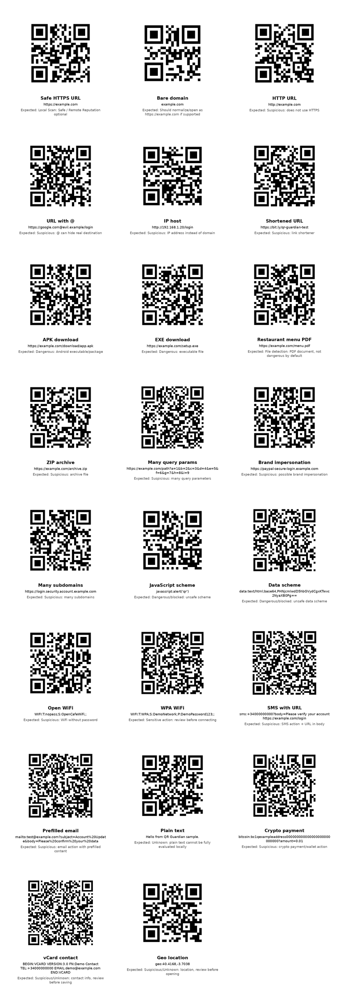

# QR Guardian sample QR dataset

This dataset is synthetic. It is meant for manual testing, demos and documentation.

Do not treat these samples as real threats. The payloads are deliberately safe demo values that exercise Local Scan, HEAD metadata checks, and optional Remote Reputation behavior.

The same text payloads are also mirrored in shared regression tests so the security pipeline can be validated without decoding the QR images.

## Preview

## What it covers

- Safe and suspicious URLs.
- Dangerous download and unsafe scheme samples.
- File-like URLs such as PDF and ZIP.
- WiFi, SMS, mailto, plain text, crypto, vCard and geo payloads.

Remote Reputation results can vary depending on which providers are configured and whether the lookup succeeds. The table below describes the expected local behavior.

## Samples

| File | Stored content | Purpose | Expected result |
|---|---|---|---|
| `qrs/01_safe_https.png` | `https://example.com` | Safe HTTPS URL | Safe |
| `qrs/02_bare_domain.png` | `example.com` | Bare domain normalization | Safe |
| `qrs/03_http_url.png` | `http://example.com` | Non-HTTPS URL | Suspicious |
| `qrs/04_at_symbol_url.png` | `https://google.com@evil.example/login` | Obfuscated destination with `@` | Suspicious |
| `qrs/05_ip_host.png` | `http://192.168.1.20/login` | IP-host URL | Suspicious |
| `qrs/06_shortener.png` | `https://bit.ly/qr-guardian-test` | Shortened URL | Suspicious |
| `qrs/07_dangerous_apk.png` | `https://example.com/download/app.apk` | APK download | Dangerous |
| `qrs/08_windows_exe.png` | `https://example.com/setup.exe` | EXE download | Dangerous |
| `qrs/09_pdf_menu.png` | `https://example.com/menu.pdf` | PDF/menu file detection | Safe |
| `qrs/10_archive_zip.png` | `https://example.com/archive.zip` | Archive download | Suspicious |
| `qrs/11_many_params.png` | `https://example.com/path?a=1&b=2&c=3&d=4&e=5&f=6&g=7&h=8&i=9` | Excessive query params | Suspicious |
| `qrs/12_brand_impersonation.png` | `https://paypal-secure-login.example.com` | Brand impersonation pattern | Suspicious |
| `qrs/13_many_subdomains.png` | `https://login.security.account.example.com` | Many subdomains | Suspicious |
| `qrs/14_dangerous_scheme_js.png` | `javascript:alert('qr')` | Unsafe JavaScript scheme | Dangerous |
| `qrs/15_data_scheme.png` | `data:text/html;base64,PHNjcmlwdD5hbGVydCgxKTwvc2NyaXB0Pg==` | Unsafe data scheme | Dangerous |
| `qrs/16_wifi_open.png` | `WIFI:T:nopass;S:OpenCafeWiFi;;` | Open WiFi QR | Suspicious |
| `qrs/17_wifi_wpa.png` | `WIFI:T:WPA;S:DemoNetwork;P:DemoPassword123;;` | Passworded WiFi QR | Suspicious |
| `qrs/18_sms_with_url.png` | `sms:+34000000000?body=Please verify your account https://example.com/login` | SMS action with URL in body | Suspicious |
| `qrs/19_mailto_prefilled.png` | `mailto:test@example.com?subject=Account%20Update&body=Please%20confirm%20your%20data` | Prefilled email action | Suspicious |
| `qrs/20_plain_text.png` | `Hello from QR Guardian sample.` | Plain text fallback | Unknown |
| `qrs/21_crypto.png` | `bitcoin:bc1qexampleaddress000000000000000000000000000?amount=0.01` | Crypto payment URI | Suspicious |
| `qrs/22_vcard.png` | `BEGIN:VCARD ... END:VCARD` | Contact card payload | Suspicious |
| `qrs/23_geo.png` | `geo:40.4168,-3.7038` | Location payload | Suspicious |

## Notes

- Local Scan always runs.
- Remote Reputation is optional and only applies to URLs.
- Non-URL payloads are `NotApplicable` for Remote Reputation.
- Use this dataset to validate classification, warning states, file detection and result rendering.
